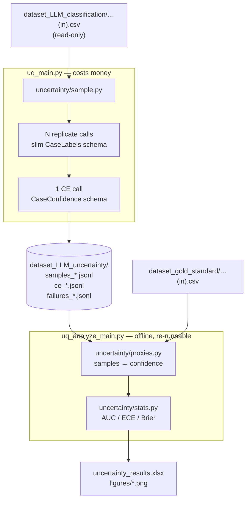

# Uncertainty Quantification for LLM Radiology Classification

**Status:** approved design, not yet implemented
**Date:** 2026-08-08
**Decision log:** `catalog.md` (project root)
**Source:** Savage T, Wang J, Gallo R, et al. *Large language model uncertainty proxies:
discrimination and calibration for medical diagnosis and treatment.*
JAMIA 2025;32(1):139–149. doi:10.1093/jamia/ocae254

Structured after `software-design-practices.md`.

---

## 1. Design what you are building

### What it is

A second measurement pipeline alongside the existing classifier. Where `main.py` answers
*"what does the model think this case shows?"*, this answers *"how much should you
believe it?"* — and then checks whether that belief is any good.

It adapts the three uncertainty proxies from Savage et al. onto this codebase's task,
substituting **reasoning effort** for the paper's **temperature** as the experimental
axis.

### Who it is for

The repository owner, as a portfolio demonstration. This is stated plainly because it
sets the acceptance bar: the deliverable is a correct, tested, legible pipeline that
produces the paper's figures on this dataset. It is **not** a valid measurement — see
the sample-size limitation in §7 — and the design deliberately trades statistical power
for cost.

### The problem

`classifier/classify.py` returns a label for each of 19 findings and no indication of
how confident the model was. A label the model would have flipped on a re-roll is
indistinguishable from one it is certain about. The paper's premise is that clinicians
cannot use an LLM that will not say when it is unsure.

### Core concepts

| Concept | Meaning here |
|---|---|
| **Proxy** | A number standing in for the model's confidence in one answer |
| **Discrimination** | Does the proxy separate right answers from wrong ones? (ROC AUC; useful ≥ 0.7) |
| **Calibration** | When the proxy says 85%, is the model right 85% of the time? (plot, ECE, Brier) |
| **Effort tier** | Canonical `low` / `medium` / `high`, mapped per provider — replaces the paper's temperature |
| **Replicate** | One of N repeated calls on the same case at the same tier |

The three proxies:

| Proxy | How it is obtained | Extra API cost |
|---|---|---|
| **SC** — sample consistency | Run the prompt N times, measure agreement | N−1 calls per case per tier |
| **CE** — confidence elicitation | Ask the model to rate its own certainty 0–100 | 1 call per case per tier |
| **TLP** — token-level probability | Read the probability of the emitted label token | none (rides on replicate 1) |

The paper's headline: SC discriminates best (ROC AUC 0.68–0.79), TLP and CE are weaker,
and CE is consistently over-confident.

### How our task differs from the paper's — and why it simplifies

| | Paper | Here |
|---|---|---|
| Task | Open-ended free-text diagnosis | Closed-set multi-label binary |
| Answer space | Any string | `{normal, abnormal}` × 19 findings |
| Extracting the answer | Regex `\[(.*?)\]` from prose | Pydantic structured output |
| "Do two answers agree?" | GPT-4 annotation, or sentence-embedding cosine similarity | `==` |
| Grading correctness | Two blinded physicians, third breaks ties | `dataset_gold_standard/` already exists |

Because the answer space is closed, **sample consistency becomes an exact majority-vote
fraction.** The paper needed an annotator LLM and two sentence-transformer models
(`pritamdeka/S-PubMedBert-MS-MARCO`, `intfloat/e5-small-v2`) purely to decide whether two
free-text diagnoses meant the same thing. None of that is needed, and two of their five
SC variants collapse into one exactly-computable number. Correctness grading is free.

### What is explicitly out of scope

- Statistical validity. N=5, one dataset, 50 cases.
- Ensemble methods (proxies computed across multiple models). The paper excludes these
  too, on cost and HIPAA grounds.
- One-step CE. The paper found two-step better; only two-step is built.
- The paper's 3×3 answer-setting × rating-setting grid. See §3, CE.
- Re-running the base classification. `main.py` output is untouched.

---

## 2. Design the user experience

Two new command-line entry points. No existing command changes behaviour.

### Happy path

```bash
# 1. See what it will cost before spending anything.
python uq_main.py --provider kimi --dry-run
#   kimi / kimi-k3
#     50 cases x 5 replicates x 3 tiers = 750 calls  + 150 CE calls
#     est. 1.08M input, 0.64M output  ->  ~$14.70
#   (dry run - no calls made)

# 2. Collect samples. Resumable; writes as it goes.
python uq_main.py --provider kimi --yes

# 3. Analyse. Free, offline, re-runnable as often as you like.
python uq_analyze_main.py
#   -> dataset_LLM_uncertainty/uncertainty_results.xlsx
#   -> dataset_LLM_uncertainty/figures/*.png
```

`--provider all` runs the three in sequence. `--tier low` restricts to one tier.
`--limit N` restricts to the first N cases. `--replicates N` overrides the default 5.

### Alternative flows

| Situation | Behaviour |
|---|---|
| Run crashes at case 40 | Re-run the same command; it counts what is already in the JSONL and requests only the shortfall |
| Provider returns no logprobs | TLP silently absent for that provider; results table cell reads `not supported` |
| A case exhausts all 10 retries | Logged to `failures_{provider}_{tier}.jsonl`, run continues |
| `uq_analyze_main.py` before any sampling | `SystemExit` naming the missing provider/tier and the command that produces it |
| A proxy group has no incorrect answers | Cell reads `N/A (no incorrect answers)` rather than crashing |
| `--yes` omitted | Cost estimate printed, then exit without calling |

### Impact on the existing interface

None. `main.py` and `evaluate_main.py` keep their arguments and their outputs. The one
change to existing code (§3) is a default argument that no current caller passes.

---

## 3. Understand the technical needs

### Architecture



**The load-bearing property: the expensive step and the iterated step are separated by a
file.** `uq_main.py` writes raw JSONL and computes nothing. `uq_analyze_main.py` reads
JSONL and calls no API. On a $23 budget this is the difference between paying once and
paying every time an ECE bug is fixed. It is the same principle that makes
`classifier/evaluate.py` pure functions over label strings.

### Modules

| File | Responsibility | Depends on |
|---|---|---|
| `uncertainty/config.py` | Effort tier table, N, paths, price table | `classifier.config` |
| `uncertainty/schemas.py` | `CaseLabels`, `CaseConfidence` | `classifier.schemas` |
| `uncertainty/llm.py` | Build a chat model for one provider at one effort tier | `classifier.config` |
| `uncertainty/sample.py` | Run one case N times at one tier; append JSONL; resume; CE call | `classifier.classify` |
| `uncertainty/proxies.py` | Raw samples → confidence values (pure) | — |
| `uncertainty/stats.py` | `(confidence, correct)` → AUC / ECE / Brier (pure) | `sklearn`, `numpy` |
| `uncertainty/probe.py` | Logprobs capability check | `classifier.llm` |
| `uq_main.py` | CLI: cost guard, provider/tier loop, thread pool | all of the above |
| `uq_analyze_main.py` | CLI: join gold, build table, write xlsx + figures | `pandas`, `matplotlib` |

`classifier.llm.build_model`, `classifier.prompt`, `classifier.csv_io` and
`classifier.schemas` are reused unchanged.

### Schemas

```python
# uncertainty/schemas.py
class FindingVote(BaseModel):
    finding: FindingName
    label: Label                       # no evidence, no reasoning

class CaseLabels(BaseModel):
    case_id: str
    findings: list[FindingVote]

class FindingConfidence(BaseModel):
    finding: FindingName
    score: int = Field(ge=0, le=100)   # 0 = definitely uncertain, 100 = definitely certain

class CaseConfidence(BaseModel):
    case_id: str
    scores: list[FindingConfidence]
```

`FindingName` and `Label` are imported from `classifier.schemas` — the enum stays the
single source of truth for what the model is asked, so the two pipelines cannot drift.

### The effort axis

```python
Tier = Literal["low", "medium", "high"]

EFFORT_LEVELS: dict[Provider, dict[Tier, str]] = {
    "openai":  {"low": "low",  "medium": "medium", "high": "high"},
    "mistral": {"low": "none", "medium": "high",   "high": "high"},
    "kimi":    {"low": "low",  "medium": "high",   "high": "max"},
}
```

Sits beside the existing `REASONING_EFFORT` dict in `classifier/config.py:26`, in one
visible table rather than hidden inside `build_model()`.

**What the substitution changes.** In the paper, temperature did double duty: it was the
experimental condition *and* the source of the randomness SC depends on. That is why
they could only run SC at temperature 0.5 and 1.0 — at 0 there was not enough variation
between responses to measure. Reasoning effort is not a randomness knob; variation
between replicates comes from ordinary sampling, present at every tier. SC is therefore
measurable at all three tiers here, which is cleaner than the paper's design.

**Mistral's `medium` and `high` are the same configuration.** Not a defect — a free
negative control. Any gap between those two columns is run-to-run sampling noise, giving
a noise floor against which the other providers' effort effects can be judged.

The mapping is verified by the probe (below) before the paid run: each tier is sent once
per provider and the response checked for acceptance, so a rejected or silently-ignored
tier is caught before it produces three identical runs.

### Providers and budget

| Provider | Model | $/1M in | $/1M out | Est. cost | Credit |
|---|---|---|---|---|---|
| openai | `gpt-5.6-luna` | 0.20 | 1.20 | ~$1.40 | $10 |
| mistral | `mistral-medium-3.5` | 1.50 | 7.50 | ~$7.40 | $10 |
| kimi | `kimi-k3` | 3.00 | 15.00 | ~$14.70 | $20 |
| | | | **total** | **~$23.50** | **$40** |

Estimates exclude retries; budget 10–20% headroom. Effort multipliers on output are
estimated at low ≈ 0.5×, high ≈ 2.5× versus medium, from the measured medium-effort
baselines in `logs/token_usage.md`. **These are replaced with measured values from a
2-case smoke run per tier before the full run.**

Groq is excluded. `gpt-5.5` was excluded on cost: its $30/1M output puts this design at
~$28 against a $10 budget. See `catalog.md` D3 for the rejected alternatives.

### The one change to existing code

`classifier/classify.py:63` gains a default argument, and line 75 uses it:

```python
def classify_case(model, prompt, case, schema=CaseClassification, max_attempts=10):
    structured = model.with_structured_output(schema, include_raw=True)
```

This lets the UQ sampler reuse the existing 10-attempt backoff loop (`backoff_seconds`
5→10→20→40→60s) rather than growing a second copy that drifts from the first. Every
current caller and all seven tests in `tests/test_classify.py` are unaffected. Line 88's
`parsed.case_id = case.case_id` works for both schemas since both declare that field.

### Sampling stage

**All N replicates use the same slim `CaseLabels` schema.** `evidence` and `reasoning`
are ~45% of output tokens and no proxy reads them. More importantly, using the full
schema for replicate 1 and the slim one for the rest would introduce a confound:
sample consistency measures variation *between replicates*, so if replicate 1 is
generated by a different prompt, part of the measured disagreement is caused by the
schema change rather than by model uncertainty — and the two are indistinguishable after
the fact. All replicates must be generated identically, which is why the paper sent one
unchanged prompt 15 times.

**N must be odd.** SC confidence is the fraction of replicates agreeing with the
majority; with an even N a binary label can split evenly and have no majority. At N=5 the
smallest majority is 3, so no tie-break rule appears anywhere in the code.

**CE is two-step and effort-matched.** Step 1 is replicate 1, already paid for. Step 2
sends the case text plus replicate 1's 19 labels back, asking for a 0–100 certainty per
finding as structured output — 19 integers, no bracket convention and no
`str.extract('(\d+)')`. CE runs at the same tier as the answer it rates. The paper
crossed answer-temperature × CE-temperature for nine values per question
(`CE_bT_0_0` … `CE_bT_10_10`); the off-diagonal answers "does the setting you *rate* at
matter separately from the setting you *answered* at", which is not the question here,
and it costs two-thirds of the CE budget.

**A cost guard runs before any API call.** `uq_main.py` prints planned call count,
estimated tokens and estimated dollars, then exits unless `--yes` is passed; `--dry-run`
prints and never proceeds. `main.py`'s `--smoke` protects against broken wiring, not
against correct wiring pointed at the wrong number; at 900 calls against a $10 account
there is no undo.

**Concurrency:** a thread pool, default 4 workers. The full matrix is 2,700 calls
(750 replicates + 150 CE, per provider), which sequentially at ~5s is nearly four hours;
four workers brings it under an hour. Safe because retry logic is
per-call — the only shared state is the JSONL append, which takes a lock.

**Artifacts**, all under `dataset_LLM_uncertainty/` (gitignored):

| File | One line per |
|---|---|
| `samples_{provider}_{tier}.jsonl` | replicate call — labels, usage, logprobs |
| `ce_{provider}_{tier}.jsonl` | CE call — 19 scores |
| `failures_{provider}_{tier}.jsonl` | case that exhausted all retries |

```json
{"provider":"kimi","tier":"low","case_id":"12345","replicate":1,
 "labels":{"pulmonary_nodules":"normal"},
 "logprobs":null,
 "usage":{"input_tokens":1180,"output_tokens":640},
 "timestamp":"2026-08-08T18:40:11"}
```

Append-only JSONL gives resume for free: count existing replicates per
`(case_id, tier)` at startup and request only the shortfall. A crash at case 40 costs
nothing, which matters when the entire Kimi budget is a single run.

### Proxy computation

`uncertainty/proxies.py` is pure functions over parsed JSONL. It emits one long-format
table, `uncertainty_proxies.csv`:

```
provider  tier  case_id  finding       proxy  confidence  answer    gold      correct  n_replicates
kimi      low   12345    cardiomegaly  SC     0.80        abnormal  abnormal  1        5
kimi      low   12345    cardiomegaly  CE     0.90        abnormal  abnormal  1        5
```

3 providers × 3 tiers × 50 cases × 19 findings × 2–3 proxies ≈ 17k–26k rows.

**Sample consistency.**

```python
def sample_consistency(labels: list[Label]) -> tuple[Label, float]:
    counts = Counter(labels)
    answer, agreed = counts.most_common(1)[0]
    return answer, agreed / len(labels)
```

**Confidence elicitation.** Answer is replicate 1's label; confidence is `score / 100`.
The paper's scale runs 0 = definitely uncertain to 100 = definitely certain, so higher
means more confident and no inversion is applied.

**Token-level probability** (built only if the probe passes). Answer is replicate 1's
label; confidence is the probability of *that finding's label token*. Mechanically: walk
the returned `logprobs.content` list and, since findings arrive in schema order, take the
value token following each `"label":` key.

This departs from the paper deliberately. They averaged (and took the minimum of) token
probabilities across a multi-token free-text answer. Here each label is one token in a
known position, so the per-finding label-token probability is simpler and strictly more
informative than averaging it with the probabilities of `{`, `"finding"` and `,`.

Conversion uses `math.exp(logprob)`. The authors' released code uses `pow(10, logprob)`,
but OpenAI returns natural log. Because `10^x` is monotonic in `x` their **ROC AUC values
are unaffected** — AUC depends only on ranking — but their **TLP calibration numbers
would be shifted**, since ECE and Brier compare the value itself against observed
accuracy.

**Correctness** joins `dataset_gold_standard/feline_thorax_manual_final_50_appended(in).csv`
through the existing `config.GOLD_TO_PREDICTION` map (handling
`Fe_Alveolar` → `Alveolar_interstitial_pattern`) and compares with
`evaluate.is_abnormal()` / `is_normal()`, so the gold file's `Abnormal` and the model's
`abnormal` resolve identically. Reusing those two functions rather than re-implementing
the casefold means the UQ study and the confusion matrix cannot disagree about what
counts as a match.

**`diseased_lungs` is excluded.** It is derived from ten other findings in
`csv_io.derive_diseased_lungs()`, never judged by the model, so it has no CE score and no
token probability. Including it for SC alone would give one row in twenty a different set
of available proxies. The analysis covers the **19 findings the model actually answers**.

**Partial cases.** SC is computed over surviving replicates and `n_replicates` records
the count. Rows with fewer than 3 are dropped before analysis, matching the paper's
"questions where the model generated an error response were not included."

### Statistics

`uncertainty/stats.py` — pure functions over a `confidence` array, a `correct` array and
a `case_id` array for clustering. No file I/O, no plotting.

**ROC AUC with a clustered bootstrap CI.** `sklearn.metrics.roc_auc_score` for the point
estimate. For the interval, resample **cases** with replacement, taking all 19 findings of
each drawn case. Row-level resampling would pretend there are 950 independent
observations when there are 50 clusters, producing intervals that are too narrow.

Two departures from the authors' notebook: 1,000 iterations rather than 4,000 (enough for
a percentile interval, 4× faster to iterate against), and percentiles 2.5/97.5 rather
than their 5/95 — their code takes the 5th and 95th percentiles and prints the result as
`"95% Confidence Interval"`, which is a 90% interval.

**ECE with adaptive binning.**

```
ECE = Σ_b  (n_b / N) · | mean_confidence_b − accuracy_b |
```

The authors bin with `pd.qcut(confidence, 10)`. SC confidence at N=5 has exactly three
distinct values (`0.6`, `0.8`, `1.0`), so `qcut` into 10 bins raises
`ValueError: Bin edges must be unique` — not a risk, a certainty. Binning therefore
adapts: if the count of distinct confidence values is at or below the requested bin
count, bin by distinct value; otherwise use quantile bins. SC gets 3 bins, CE up to 10,
one function handles both.

**Brier score** is `mean((confidence − correct)²)`. No binning, nothing to break.

**The 0.7 threshold.** The paper computes calibration only for proxies clearing ROC AUC
0.7. At N=5 that may be nowhere, so calibration is computed for everything and a
`meets_threshold` column flags which cleared it — a table of numbers with a flag teaches
more than a table of empty cells.

### Outputs

`uncertainty_results.xlsx`, one sheet per provider:

| tier | proxy | n | AUC | CI low | CI high | ECE | Brier | mean conf. | obs. acc. | meets 0.7 |
|---|---|---|---|---|---|---|---|---|---|---|
| low | SC | 950 | 0.71 | 0.63 | 0.78 | 0.14 | 0.11 | 0.86 | 0.72 | ✓ |

Plus `figures/calibration_{provider}_{tier}.png` (confidence against observed accuracy
with the diagonal, proxies overlaid — the paper's Figure 5 layout) and
`figures/roc_{provider}.png`.

### Third-party additions

`requirements.txt` gains `scikit-learn` and `matplotlib`. `numpy` arrives with pandas.

### Edge cases

| Case | Handling |
|---|---|
| Case exhausts all 10 retries | Line in `failures_*.jsonl`; run continues |
| Fewer than 3 surviving replicates | Row dropped from analysis; count retained in the report |
| Provider returns no logprobs | TLP omitted for that provider; cell reads `not supported` |
| Proxy group has no incorrect answers | `N/A (no incorrect answers)` instead of a `roc_auc_score` exception |
| Proxy returns one distinct value | AUC is 0.5 by construction; cell says so |
| `qcut` cannot make 10 unique edges | Adaptive binning falls back to distinct values |
| Sample files missing at analysis time | `SystemExit` naming provider, tier and the producing command |
| Effort tier rejected by a provider | Caught by the probe before the paid run |

---

## 4. Implement testing and security measures

### Coverage goal

Not a percentage. Every pure function in `proxies.py` and `stats.py` gets a
known-answer test, and every decision that could silently regress gets one test that
pins it. Conventions follow `tests/test_classify.py`: fakes, no API, no files, `pytest`
alone runs everything.

### `tests/test_proxies.py`

- `[ab, ab, ab, ab, ab]` → `(abnormal, 1.0)`; `[ab, ab, ab, n, n]` → `(abnormal, 0.6)`
- CE score `90` → confidence `0.90`
- **TLP: logprob `−0.03` → `0.970`, not `0.933`** — pins the `exp` vs `pow(10, ·)` decision
- gold `"Abnormal"` against predicted `"abnormal"` scores correct
- a case with 2 surviving replicates is dropped; `n_replicates` recorded on those kept
- `diseased_lungs` never appears in the output table

### `tests/test_stats.py`

- perfect separator → AUC 1.0; constant confidence → AUC 0.5
- synthetic perfectly-calibrated set → ECE ≈ 0
- confident perfect predictor → Brier 0
- **three distinct confidence values with 10 bins requested does not raise** — the
  regression test for the `qcut` crash
- clustered bootstrap gives a wider interval than row-level resampling on the same data,
  proving the clustering is real rather than a comment

### `tests/test_uq_sample.py`

- given a JSONL already holding 3 replicates for a case, the sampler requests exactly 2
- a failing case writes to the failures file and the run continues
- `--dry-run` makes zero calls — the fake model asserts `calls == 0`

### Side effects on existing code

One: the `schema` default argument on `classify_case`. `tests/test_classify.py` must
continue to pass unmodified — that is the acceptance criterion for the change.

### Security

No new secrets and no new key handling. Keys stay in `.env` behind `SecretStr` in
`classifier/config.py`, and every module in `uncertainty/` takes an already-built model
as an argument exactly as `classify_case` does, so nothing in the new package ever
touches a key. No security audit needed.

`.gitignore` gains `dataset_LLM_uncertainty/` and `figures/`. The paper, its supplementary
data and the authors' released code (`ocae254.pdf`,
`ocae254_supplementary_data.docx`, `25962529/`) are already ignored — reference material,
not ours to redistribute.

---

## 5. Plan the work

Ordered so that the cheapest, most informative steps come first and nothing expensive
runs before it is proven.

| # | Milestone | Deliverable | Gate |
|---|---|---|---|
| 1 | Schemas + config | `uncertainty/schemas.py`, `config.py`, effort table, price table | imports clean |
| 2 | `classify_case` schema argument | one-line change | `tests/test_classify.py` passes unmodified |
| 3 | Probe | `uncertainty/probe.py` | run it (~$0.05); record result in `catalog.md` |
| 4 | Tier + token calibration | 2-case smoke run per provider per tier | measured multipliers replace estimates; cost table updated |
| 5 | Sampler + cost guard | `uncertainty/sample.py`, `uq_main.py` | `tests/test_uq_sample.py` green; `--dry-run` shows sane numbers |
| 6 | **Paid run** | populated `dataset_LLM_uncertainty/*.jsonl` | spend within budget |
| 7 | Proxies | `uncertainty/proxies.py`, `uncertainty_proxies.csv` | `tests/test_proxies.py` green |
| 8 | Statistics | `uncertainty/stats.py` | `tests/test_stats.py` green |
| 9 | Report + figures | `uq_analyze_main.py`, xlsx, PNGs | figures render; numbers sane |
| 10 | TLP | only if step 3 said yes | `tests/test_proxies.py` TLP cases green |

Steps 7–9 are free to re-run, which is why step 6 comes before them and only once.

### Risk factors

| Risk | Likelihood | Mitigation |
|---|---|---|
| Logprobs unavailable everywhere | high | Step 3 costs $0.05 and gates step 10; CE + SC ship regardless |
| A provider ignores `reasoning_effort` silently | medium | Step 4 compares token counts across tiers — identical counts mean the knob did nothing |
| Effort multipliers wrong, run overruns budget | medium | Step 4 measures them; cost guard re-estimates with measured values before step 6 |
| Rate limits under 4 workers | medium | Existing per-call backoff; `--workers 1` fallback |
| Structured output degrades without the reasoning field | low | Compare step-4 smoke labels against existing `main.py` output for the same cases |
| Mistral rejects `none` as an effort value | medium | Caught by the probe; fall back to omitting the parameter for that tier |

### Definition of done

**Required:** steps 1–9. CE and SC for all three providers, at all three tiers, over 50
cases, with the results workbook and calibration figures produced, and all tests green.

**Optional, can follow later:** step 10 (TLP), ROC figures, re-running the base
classification on `gpt-5.6-luna` for consistency with the existing confusion matrix.

### Migration scripts

None. No existing file is read differently or rewritten.

---

## 6. Identify ripple effects

| Item | Action |
|---|---|
| `.gitignore` | add `dataset_LLM_uncertainty/`, `figures/` |
| `requirements.txt` | add `scikit-learn`, `matplotlib` |
| `catalog.md` | append each decision as it lands; record the probe result |
| `logs/token_usage.md` | `uq_main.py` appends its own section, reusing `append_token_log`'s format so both pipelines report spend in one place |
| `plan.md` | receives the implementation plan |
| `classifier/classify.py` | one default argument; docstring notes both callers |

**The one real inconsistency to communicate:** the existing
`feline_thorax_labeled_openai.csv` and the confusion matrix were produced on `gpt-5.5`,
while the UQ study runs `gpt-5.6-luna`. Any write-up must either re-run the base
classification on luna (~$0.30) or state the mismatch explicitly. It is recorded in
`catalog.md` D3 as an open item.

No external systems, no users to notify.

---

## 7. Understand the broader context

### Limitations of this design

**N=5 is the big one.** With binary labels SC confidence is a majority-vote fraction, so
five replicates yield exactly three distinct values: `{0.6, 0.8, 1.0}`. Every SC ROC curve
will have three points, and the 10-bin calibration plot degenerates to three bins. N
matters *more* here than in the paper, whose free-text answers produced finely-graded
agreement scores across 15 samples. The fix is one config change and roughly 3× the
budget.

**50 cases, one dataset, one species, one modality.** The paper used 723 questions across
three datasets.

**Mistral's medium and high tiers are identical**, so that provider contributes two
effort levels of signal and one of noise measurement.

**Effort is not temperature.** The substitution is the point of the exercise, but it
means results are not directly comparable to the paper's numbers — reasoning effort
changes how much the model thinks, temperature changes how it samples. A difference
found here is a different phenomenon from the one they measured.

**Gold standard as ground truth.** Correctness is agreement with one manual annotation
pass, where the paper used two blinded physicians with a third for disagreements.

### Possible extensions

- Raise N to 15 and reproduce the paper's design properly.
- Bring Groq back; the pipeline is provider-agnostic, so it is a config change.
- Sentence-embedding SC over the `evidence` strings rather than the labels — the one
  place the paper's cosine-similarity method would still add something, since evidence is
  free text.
- Per-finding subgroup analysis: which of the 19 findings are the proxies best at?
  Requires more cases per finding than 50 provides.
- Ensemble proxies across the three providers — the paper excludes these on cost and
  HIPAA grounds, neither of which binds a portfolio project.
- One-step versus two-step CE, reproducing their Figure 1 comparison.

### Moonshots

- Feed the proxy back into the pipeline: have `main.py` flag low-confidence findings for
  human review, turning a measurement into a product feature.
- Use SC disagreement to find the ambiguous cases in the gold standard itself — findings
  where the model is consistently split may be findings where the report genuinely does
  not say.

### Budget

~$23.50 of ~$40 available credit, leaving headroom for retries and one re-run. The probe
costs ~$0.05 and the tier calibration ~$0.50. Steps 7–9 are free and unlimited.
